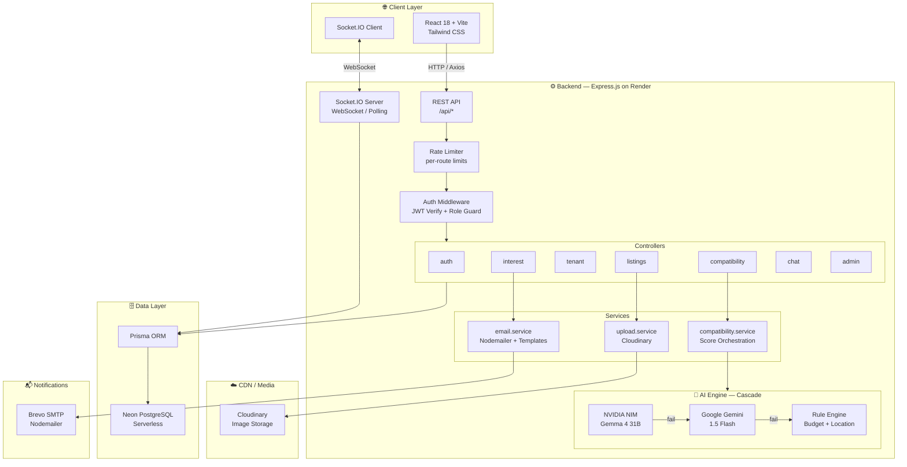
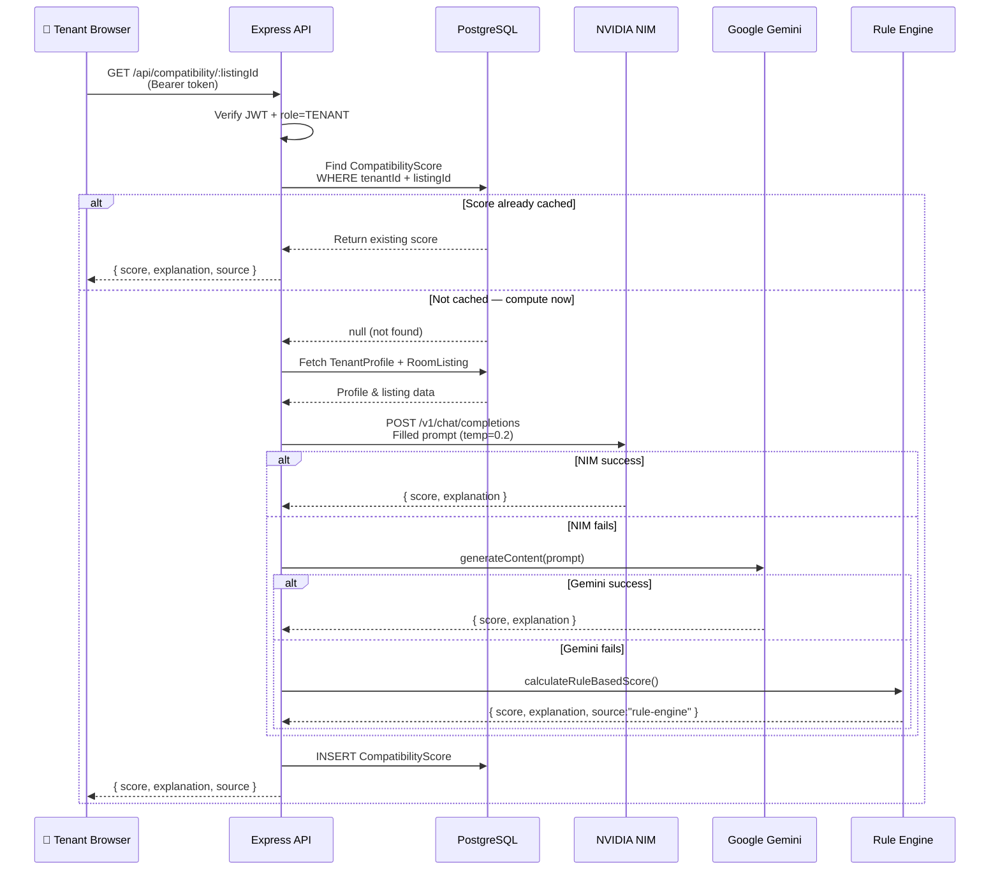
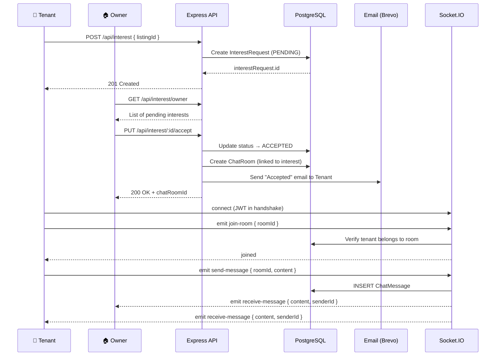

# 🏠 RoomYaaro — Find Your Room. Find Your Yaar.

> AI-powered rental platform that matches tenants to room listings through compatibility scoring, real-time chat, and smart interest management. Built with Node.js, React, PostgreSQL, Google Gemini, and Socket.IO.

---

## ✨ Features

| Feature | Description |
|---------|-------------|
| 🔐 Role-Based Auth | Owner, Tenant, Admin roles with JWT authentication |
| 🏘️ Room Listings | Full CRUD with Cloudinary photo uploads |
| 🤖 AI Compatibility Scoring | Google Gemini → NVIDIA NIM → Rule Engine (cascading fallback) |
| 🎯 Ranked Recommendations | Tenant-specific listings ranked by compatibility score |
| 💬 Real-Time Chat | Socket.IO messaging between tenants and owners (accepted interests only) |
| 📩 Email Notifications | HTML emails for high-match alerts, accepted/rejected interests |
| 🔑 Forgot/Reset Password | Expiring token-based password reset via email |
| 🌗 Light/Dark Mode | Full theme switching persisted in localStorage |
| 🛡️ Admin Dashboard | User management, listing oversight, platform analytics |
| 🔍 Search & Filters | Filter by location, rent range, room type, furnishing status |

---

## 🏗️ System Architecture



---

## 🔄 Request Processing Flow

### Compatibility Score Request



### Interest → Chat Flow



---


## 🛠️ Tech Stack

| Layer | Technology |
|-------|-----------|
| **Backend Runtime** | Node.js 20, Express.js |
| **Database** | PostgreSQL (Neon serverless) + Prisma ORM |
| **Auth** | JWT (Bearer token), bcryptjs |
| **AI Engine** | Google Gemini 1.5 Flash, NVIDIA NIM (Gemma 4), Rule Engine fallback |
| **Real-Time** | Socket.IO (WebSocket + polling) |
| **Email** | Nodemailer + Brevo SMTP |
| **Images** | Cloudinary (multipart upload via Multer) |
| **Frontend** | React 18, Vite, Tailwind CSS, React Router v6 |
| **State** | Context API (Auth, Toast, Theme) |
| **Rate Limiting** | express-rate-limit per route group |
| **Deployment** | Vercel (frontend), Render (backend), Neon (DB), Cloudinary (media) |

---

## 📁 Project Structure

```
roomyaaro/
├── backend/
│   ├── prisma/
│   │   └── schema.prisma          # Database schema
│   ├── src/
│   │   ├── config/
│   │   │   └── db.js              # Prisma client singleton
│   │   ├── controllers/
│   │   │   ├── auth.controller.js
│   │   │   ├── listing.controller.js
│   │   │   ├── tenant.controller.js
│   │   │   ├── compatibility.controller.js
│   │   │   ├── interest.controller.js
│   │   │   ├── chat.controller.js
│   │   │   └── admin.controller.js
│   │   ├── middlewares/
│   │   │   ├── auth.middleware.js  # JWT verify + role guard
│   │   │   └── rateLimiter.js      # Per-route rate limits
│   │   ├── routes/
│   │   │   ├── auth.routes.js
│   │   │   ├── listing.routes.js
│   │   │   ├── tenant.routes.js
│   │   │   ├── compatibility.routes.js
│   │   │   ├── interest.routes.js
│   │   │   ├── chat.routes.js
│   │   │   └── admin.routes.js
│   │   ├── services/
│   │   │   ├── compatibility.service.js  # LLM orchestration + score caching
│   │   │   ├── ruleEngine.service.js     # Budget + location rule fallback
│   │   │   ├── email.service.js          # Nodemailer + HTML templates
│   │   │   └── upload.service.js         # Cloudinary helpers
│   │   ├── sockets/
│   │   │   └── chat.socket.js            # Socket.IO event handlers
│   │   ├── prompts/
│   │   │   └── compatibility.js          # LLM prompt template + builder
│   │   └── utils/
│   │       └── seed.js                   # Admin seeder
│   └── server.js                         # Express + Socket.IO bootstrap
│
└── frontend/
    └── src/
        ├── components/            # Navbar, ProtectedRoute, cards, etc.
        ├── contexts/              # AuthContext, ThemeContext, ToastContext
        ├── layouts/               # AppLayout, PublicLayout
        ├── pages/
        │   ├── Home.jsx
        │   ├── Login.jsx
        │   ├── Register.jsx
        │   ├── ForgotPassword.jsx
        │   ├── ResetPassword.jsx
        │   ├── BrowseListings.jsx
        │   ├── ListingDetail.jsx
        │   ├── Chat.jsx
        │   ├── tenant/            # TenantDashboard, Profile, Recommendations, Interests
        │   ├── owner/             # OwnerDashboard, CreateListing, OwnerListings, OwnerInterests
        │   └── admin/             # AdminDashboard, AdminUsers, AdminListings, AdminAnalytics
        ├── services/
        │   └── api.js             # Axios instance with interceptors
        └── index.css              # Design tokens + Tailwind overrides
```

---

## 🚀 Quick Start

### Prerequisites

- Node.js 18+
- PostgreSQL database — use [Neon](https://neon.tech) for a free serverless instance
- A Google Gemini API key ([get one free](https://aistudio.google.com))
- Cloudinary account (for image uploads)
- SMTP provider (Brevo/Gmail/any SMTP)

---

### 1 · Clone & Install

```bash
git clone https://github.com/your-username/roomyaaro.git
cd roomyaaro

# Install backend deps
cd backend && npm install

# Install frontend deps
cd ../frontend && npm install
```

---

### 2 · Configure Environment Variables

```bash
# Backend
cd backend && cp .env.example .env

# Frontend
cd ../frontend && cp .env.example .env
```

Fill in all values as described in the **Environment Variables** section below.

---

### 3 · Set Up the Database

```bash
cd backend

npx prisma generate   # Generate Prisma client
npx prisma db push    # Push schema to your database
npm run db:seed       # Create default admin account
```

> **Default admin after seeding:**
> - Email: `admin@roomyaaro.com`
> - Password: `Admin@123456`

---

### 4 · Run Locally

```bash
# Terminal 1 — Backend API (http://localhost:5000)
cd backend && npm run dev

# Terminal 2 — Frontend (http://localhost:5173)
cd frontend && npm run dev
```

---

## 🔑 Environment Variables

### Backend — `backend/.env`

| Variable | Required | Description |
|----------|:--------:|-------------|
| `PORT` | | Server port (default: `5000`) |
| `NODE_ENV` | | `development` or `production` |
| `CLIENT_URL` | ✅ | Frontend origin URL (CORS + email links) |
| `DATABASE_URL` | ✅ | PostgreSQL connection string |
| `JWT_SECRET` | ✅ | Random secret for signing JWT tokens |
| `JWT_EXPIRES_IN` | | Token lifetime (default: `7d`) |
| `GEMINI_API_KEY` | ✅ | Google Gemini API key (primary AI) |
| `NVIDIA_API_KEY` | | NVIDIA NIM key (secondary AI, optional) |
| `NVIDIA_MODEL` | | NIM model ID (default: `google/gemma-4-31b-it`) |
| `NVIDIA_INVOKE_URL` | | NIM endpoint URL |
| `SMTP_HOST` | ✅ | SMTP server hostname |
| `SMTP_PORT` | ✅ | SMTP port (587 for TLS) |
| `SMTP_USER` | ✅ | SMTP username |
| `SMTP_PASS` | ✅ | SMTP password or API key |
| `EMAIL_FROM` | ✅ | Sender name + address e.g. `RoomYaaro <no-reply@roomyaaro.com>` |
| `CLOUDINARY_CLOUD_NAME` | ✅ | Cloudinary cloud name |
| `CLOUDINARY_API_KEY` | ✅ | Cloudinary API key |
| `CLOUDINARY_API_SECRET` | ✅ | Cloudinary API secret |
| `ADMIN_EMAIL` | | Seeded admin email |
| `ADMIN_PASSWORD` | | Seeded admin password |
| `ADMIN_NAME` | | Seeded admin display name |

### Frontend — `frontend/.env`

| Variable | Required | Description |
|----------|:--------:|-------------|
| `VITE_API_URL` | ✅ | Backend API base URL (e.g. `http://localhost:5000/api`) |
| `VITE_SOCKET_URL` | ✅ | Socket.IO server URL (e.g. `http://localhost:5000`) |

---

## 📡 API Reference

### Authentication

| Method | Endpoint | Auth | Description |
|--------|----------|------|-------------|
| `POST` | `/api/auth/register` | Public | Register as Owner or Tenant |
| `POST` | `/api/auth/login` | Public | Login — returns JWT |
| `GET` | `/api/auth/me` | Bearer | Current authenticated user |
| `POST` | `/api/auth/forgot-password` | Public | Request password-reset email |
| `POST` | `/api/auth/reset-password` | Public | Submit token + new password |

**Register body:**
```json
{
  "name": "Kartik Pandey",
  "email": "kartik@example.com",
  "password": "Secret@123",
  "role": "TENANT",
  "phone": "9876543210"
}
```

**Login response:**
```json
{
  "token": "eyJhbGciOiJIUzI1NiIsInR5cCI6IkpXVCJ9...",
  "user": { "id": "clxxx", "name": "Kartik Pandey", "role": "TENANT" }
}
```

---

### Listings

| Method | Endpoint | Auth | Description |
|--------|----------|------|-------------|
| `GET` | `/api/listings` | Public | Search/filter all listings |
| `GET` | `/api/listings/:id` | Public | Single listing with photos |
| `POST` | `/api/listings` | Owner | Create listing (`multipart/form-data`) |
| `PUT` | `/api/listings/:id` | Owner | Update listing |
| `DELETE` | `/api/listings/:id` | Owner | Soft-delete listing |
| `PATCH` | `/api/listings/:id/fill` | Owner | Mark listing as filled |

**Query parameters for `GET /api/listings`:**
```
?location=Mumbai&minRent=5000&maxRent=15000
  &roomType=SINGLE&furnishingStatus=FURNISHED
  &page=1&limit=10
```

---

### Tenant

| Method | Endpoint | Auth | Description |
|--------|----------|------|-------------|
| `GET` | `/api/tenant/profile` | Tenant | Fetch own tenant profile |
| `PUT` | `/api/tenant/profile` | Tenant | Update location/budget/move-in |
| `GET` | `/api/tenant/dashboard` | Tenant | Summary stats |
| `GET` | `/api/tenant/recommendations` | Tenant | AI-ranked listing recommendations |

---

### Compatibility

| Method | Endpoint | Auth | Description |
|--------|----------|------|-------------|
| `GET` | `/api/compatibility/:listingId` | Tenant | Get or generate compatibility score |

**Response:**
```json
{
  "score": 87,
  "explanation": "Excellent match! Rent ₹8,000 is within your ₹6,000–₹10,000 range and the location aligns with your preference.",
  "source": "gemini"
}
```

---

### Interests

| Method | Endpoint | Auth | Description |
|--------|----------|------|-------------|
| `POST` | `/api/interest` | Tenant | Express interest in a listing |
| `GET` | `/api/interest/tenant` | Tenant | Own interest requests |
| `GET` | `/api/interest/owner` | Owner | Interests across own listings |
| `PUT` | `/api/interest/:id/accept` | Owner | Accept → creates chat room + email |
| `PUT` | `/api/interest/:id/reject` | Owner | Reject → sends rejection email |

---

### Chat

| Method | Endpoint | Auth | Description |
|--------|----------|------|-------------|
| `GET` | `/api/chat/rooms` | Bearer | All chat rooms for current user |
| `GET` | `/api/chat/:roomId` | Bearer | Paginated message history |

**Socket.IO Events:**

| Event | Direction | Payload |
|-------|-----------|---------|
| `join-room` | Client → Server | `{ roomId }` |
| `leave-room` | Client → Server | `{ roomId }` |
| `send-message` | Client → Server | `{ roomId, content }` |
| `receive-message` | Server → Client | `{ id, content, senderId, createdAt }` |
| `typing` | Client → Server | `{ roomId, isTyping }` |

---

### Admin

| Method | Endpoint | Auth | Description |
|--------|----------|------|-------------|
| `GET` | `/api/admin/dashboard` | Admin | Platform-wide stats |
| `GET` | `/api/admin/users` | Admin | All users list |
| `DELETE` | `/api/admin/user/:id` | Admin | Hard-delete a user |
| `PATCH` | `/api/admin/user/:id/toggle` | Admin | Enable / disable a user |
| `GET` | `/api/admin/listings` | Admin | All listings (incl. deleted) |
| `DELETE` | `/api/admin/listing/:id` | Admin | Hard-delete a listing |
| `GET` | `/api/admin/analytics` | Admin | Engagement analytics |

---

### Utilities

| Method | Endpoint | Auth | Description |
|--------|----------|------|-------------|
| `GET` | `/api/test-email` | Public | Fire test emails (dev only) |

---

## 🗄️ Database Schema

```
┌──────────────────────────────────────────────────────────────────┐
│  User                                                            │
│  id · name · email · phone · password · role · isActive         │
│  isEmailVerified · emailVerifyToken · passwordResetToken         │
│  passwordResetExpiry                                             │
├──────────────────────────────────────────────────────────────────┤
│  TenantProfile  (1:1 → User)                                     │
│  preferredLocation · minBudget · maxBudget · moveInDate          │
├──────────────────────────────────────────────────────────────────┤
│  RoomListing  (N:1 → User/Owner)                                 │
│  title · location · rent · roomType · furnishingStatus           │
│  availableFrom · status(AVAILABLE|FILLED) · isDeleted            │
├──────────────────────────────────────────────────────────────────┤
│  ListingPhoto  (N:1 → RoomListing)                               │
│  url · publicId · order                                          │
├──────────────────────────────────────────────────────────────────┤
│  CompatibilityScore  @@unique[tenantId, listingId]               │
│  score(0–100) · explanation · source(gemini|nvidia|rule-engine)  │
├──────────────────────────────────────────────────────────────────┤
│  InterestRequest  @@unique[tenantId, listingId]                  │
│  status: PENDING → ACCEPTED | REJECTED                           │
├──────────────────────────────────────────────────────────────────┤
│  ChatRoom  (1:1 → InterestRequest, created on ACCEPTED only)     │
├──────────────────────────────────────────────────────────────────┤
│  ChatMessage  (N:1 → ChatRoom · N:1 → User/Sender)              │
│  content · isRead · createdAt                                    │
├──────────────────────────────────────────────────────────────────┤
│  EmailNotification  (N:1 → User)                                 │
│  type: HIGH_MATCH|INTEREST_ACCEPTED|INTEREST_REJECTED|GENERAL    │
│  subject · body · isSent · sentAt                                │
├──────────────────────────────────────────────────────────────────┤
│  SavedListing  @@unique[tenantId, listingId]                     │
└──────────────────────────────────────────────────────────────────┘
```

Full schema: [`backend/prisma/schema.prisma`](./backend/prisma/schema.prisma)

---

## 🤖 LLM Compatibility Prompt

### Prompt Template

```
You are a rental compatibility expert. Given a tenant profile and a room listing,
calculate a compatibility score between 0 and 100.

Consider these factors:
- Budget alignment (tenant's min/max budget vs listing rent)
- Location preference match
- Move-in date vs listing availability
- Room type and furnishing preferences

Respond ONLY with valid JSON in this exact format:
{
  "score": <number 0-100>,
  "explanation": "<2-3 sentence explanation of the score>"
}

Tenant Profile:
- Preferred Location: {preferredLocation}
- Budget Range: ₹{minBudget} - ₹{maxBudget}
- Move-in Date: {moveInDate}

Room Listing:
- Title: {title}
- Location: {location}
- Rent: ₹{rent}
- Available From: {availableFrom}
- Room Type: {roomType}
- Furnishing: {furnishingStatus}
- Description: {description}
```

### Filled Example

```
Tenant Profile:
- Preferred Location: Koramangala, Bangalore
- Budget Range: ₹6000 - ₹10000
- Move-in Date: 8/1/2026

Room Listing:
- Title: Cozy Single Room in Koramangala
- Location: Koramangala 5th Block, Bangalore
- Rent: ₹8000
- Available From: 8/1/2026
- Room Type: SINGLE
- Furnishing: FURNISHED
- Description: A bright, airy single room with attached bathroom, Wi-Fi, and 24hr security.
```

### Example Response

```json
{
  "score": 91,
  "explanation": "Excellent match! The rent of ₹8,000 falls perfectly within your budget of ₹6,000–₹10,000. The listing is in Koramangala 5th Block which closely matches your preferred area, and it becomes available exactly on your intended move-in date."
}
```

### Fallback Cascade

When LLM APIs are unavailable the deterministic rule engine runs:

| Factor | Max Points | Logic |
|--------|:----------:|-------|
| Budget match | 60 | Within range = 60 pts; penalised proportionally outside |
| Location match | 40 | Exact = 40; partial word overlap = proportional; no match = 5 |

Scores are cached in `CompatibilityScore` — the LLM is called **at most once** per (tenant, listing) pair.

---

## 🚢 Deployment

| Service | Platform | Notes |
|---------|----------|-------|
| Frontend | [Vercel](https://vercel.com) | Set `VITE_*` vars in dashboard |
| Backend | [Render](https://render.com) | Set all backend vars; start command: `npm start` |
| Database | [Neon](https://neon.tech) | Free serverless PostgreSQL |
| Images | [Cloudinary](https://cloudinary.com) | Free tier: ~300 K images/month |

---

### ⚡ Fix: Vercel 404 on Page Refresh

React Router is **client-side only**. When a user refreshes `/login` or any deep route, Vercel looks for an actual file there — it doesn't exist — and returns `404: NOT_FOUND`.

**The fix is already included** in [`frontend/vercel.json`](./frontend/vercel.json):

```json
{
  "rewrites": [
    { "source": "/(.*)", "destination": "/index.html" }
  ]
}
```

This tells Vercel to serve `index.html` for every route and let React Router handle the navigation client-side. **Make sure this file is committed before you deploy.**

---

### 🐢 Fix: Render Free Tier Cold Start (Slow First Load)

Render's free tier **spins down your backend after 15 minutes of inactivity**. The first request after spin-down can take 20–50 seconds. Two mitigations are already built in:

1. **Warm-up ping** — `frontend/src/main.jsx` fires `GET /api/health` silently as soon as the React app boots. This wakes the server while the user is still looking at the homepage.

2. **Cold-start banner** — `BrowseListings.jsx` shows an amber warning after 5 seconds of loading:
   > *"The server was idle. First load may take 20–40 seconds on the free tier."*

3. **Skeleton loaders** — instead of a blank spinner, 6 skeleton cards are shown so the page feels alive while waiting.

> **Pro tip:** If you upgrade to Render's paid tier ($7/month), cold starts are eliminated entirely. Alternatively, add an uptime robot (e.g., [UptimeRobot](https://uptimerobot.com)) to ping `/api/health` every 14 minutes and keep the server warm for free.

---

### ✅ Pre-Deploy Checklist

**Backend (Render):**
```bash
# 1. Push schema to your production database
npx prisma generate
npx prisma db push

# 2. Seed the admin account
npm run db:seed

# 3. Set all environment variables in Render dashboard
#    (See backend/.env.example for the full list)
```

**Frontend (Vercel):**
```bash
# 1. Set environment variables in Vercel dashboard:
#    VITE_API_URL  = https://your-app.onrender.com/api
#    VITE_SOCKET_URL = https://your-app.onrender.com

# 2. Ensure vercel.json is committed (fixes 404 on refresh)
# 3. Deploy via Vercel CLI or GitHub integration
```

---

## 📜 License

MIT © 2026 RoomYaaro

